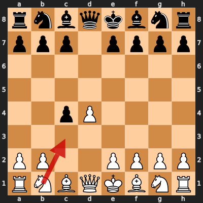
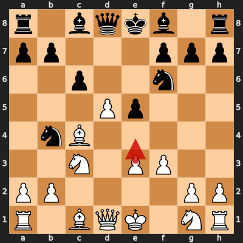
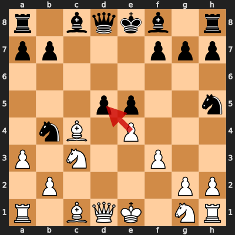

# Game 1: diegoami vs amirsaboor

| | |
|---|---|
| Date | 2024.10.19 |
| Result | 0-1 |
| White | diegoami (1586) |
| Black | amirsaboor (1624) |
| Opening | [D20](https://www.chess.com/openings/Queens-Gambit-Accepted-3.Nc3-Nf6) |
| Time control | 1/86400 |
| Termination | amirsaboor won by resignation |
| Source | [chess.com](https://www.chess.com/analysis/collection/analyzed-games-GfNkLXga/26Kjthf1tr/analysis) |

[Download PGN](1/1.pgn)

## Opening theory

**Opening moves**: 1. d4 d5 2. c4 dxc4



Matches a cataloged line (*Queen's Gambit Accepted*, ECO D20) through 2... dxc4. diegoami played 3. Nc3, the first move not found in any named line in this dataset.

**Known continuations from here:**

- 3. Nf3 (*Queen's Gambit Accepted: Normal Variation*, D21)
- 3. Qa4+ (*Queen's Gambit Accepted: Accelerated Mannheim Variation*, D20)
- 3. e3 (*Queen's Gambit Accepted: Old Variation*, D20)

## Blunders by diegoami

### Move 8. e4 (Mistake)

**Moves from the start of the game**: 1. d4 d5 2. c4 dxc4 3. Nc3 Nf6 4. f3 Nc6 5. e3 e5 6. d5 Nb4 7. Bxc4 c6

**Better was:** 8. dxc6 Qxd1+ 9. Kxd1 bxc6 10. Nh3 Nfd5 11. Na4 Be6 =

**Best continuation:** 8... cxd5 ∓



### Move 10. exd5 (Blunder)

**Moves since the previous diagram**: 8. e4 Nh5 9. a3 cxd5

**Better was:** 10. Bb5+ Nc6 11. exd5 a6 12. Ba4 b5 13. dxc6 bxa4 ±

**Best continuation:** 10... Qh4+ 11. g3 Qxc4 12. axb4 Bxb4 13. Ne2 Nf6 14. O-O ∓



## Full PGN

<details>
<summary>Show movetext</summary>

```pgn
[Event "Let's Play!"]
[Site "Chess.com"]
[Date "2024.10.19"]
[Round "-"]
[White "diegoami"]
[Black "amirsaboor"]
[Result "0-1"]
[Timezone "UTC"]
[ECO "D20"]
[ECOUrl "https://www.chess.com/openings/Queens-Gambit-Accepted-3.Nc3-Nf6"]
[UTCDate "2024.10.19"]
[UTCTime "10:48:30"]
[WhiteElo "1586"]
[BlackElo "1624"]
[TimeControl "1/86400"]
[Termination "amirsaboor won by resignation"]
[StartTime "10:48:30"]
[EndDate "2024.11.03"]
[EndTime "13:37:31"]
[Link "https://www.chess.com/analysis/collection/analyzed-games-GfNkLXga/26Kjthf1tr/analysis"]
[WhiteUrl "https://images.chesscomfiles.com/uploads/v1/user/2266038.06508423.50x50o.6f4f2723e39c.jpeg"]
[WhiteCountry "225"]
[WhiteTitle ""]
[BlackUrl "https://images.chesscomfiles.com/uploads/v1/user/23328588.82006a64.50x50o.3fb9557c7011.jpeg"]
[BlackCountry "71"]
[BlackTitle ""]

1. d4 { +0.17 } 1... d5 { +0.30 } 2. c4 { +0.31 } 2... dxc4 { +0.36 } 3. Nc3 { +0.25 } 3... Nf6 { +0.21 } 4. f3 $6 { -0.64 } ( 4. Nf3 e6 $10 ) 4... Nc6 { -0.66 } ( 4... a6 5. e3 $15 ) 5. e3 { -1.00 } 5... e5 { -0.97 } 6. d5 { -1.02 } 6... Nb4 $6 { -0.15 } ( 6... Na5 7. Qa4+ c6 8. dxc6 Nxc6 9. Bxc4 a6 10. Nge2 $17 ) 7. Bxc4 { -0.27 } ( 7. Bxc4 $10 ) 7... c6 { -0.16 } 8. e4 $2 { -1.39 } ( 8. dxc6 Qxd1+ 9. Kxd1 bxc6 10. Nh3 Nfd5 11. Na4 Be6 $10 ) 8... Nh5 $2 { +0.51 } ( 8... cxd5 $17 ) ( 8... cxd5 $17 ) 9. a3 { +0.28 } ( 9. Be3 cxd5 $14 ) 9... cxd5 $6 { +1.02 } ( 9... Qh4+ 10. g3 $10 ) 10. exd5 $4 { -2.32 } ( 10. Bb5+ Nc6 11. exd5 a6 12. Ba4 b5 13. dxc6 bxa4 $16 ) ( 10. Bb5+ Nc6 11. exd5 a6 12. Ba4 b5 13. dxc6 bxa4 $16 ) 10... Qh4+ { -2.20 } ( 10... Qh4+ 11. g3 Qxc4 12. axb4 Bxb4 13. Ne2 Nf6 14. O-O $17 ) 0-1
```
</details>
