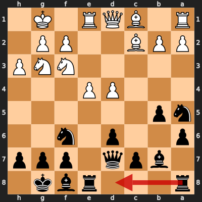
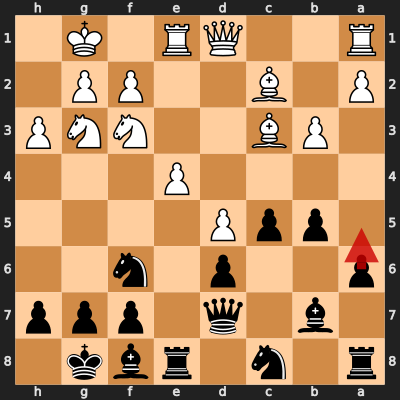
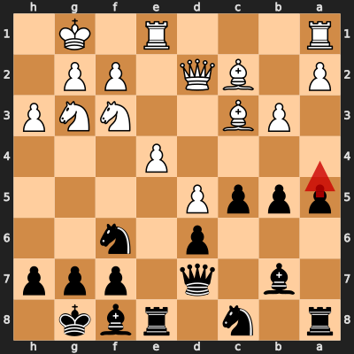

# Game 2: petrit68 vs diegoami

| | |
|---|---|
| Date | 2024.10.02 |
| Result | 1-0 |
| White | petrit68 (1678) |
| Black | diegoami (1602) |
| Opening | C77 |
| Time control | 1/86400 |
| Termination | petrit68 won by resignation |
| Source | [chess.com](https://www.chess.com/analysis/collection/analyzed-games-GfNkLXga/3zPfMHgX26/games) |

[Download PGN](2/2.pgn)

## Blunders by diegoami

### Move 15... Rad8 (Mistake)

_Moves from the start of the game: 1. e4 e5 2. Nf3 Nc6 3. Bb5 a6 4. Ba4 Nf6 5. O-O d6 6. Re1 Be7 7. c3 O-O 8. h3 b5 9. Bb3 Bb7 10. d4 exd4 11. cxd4 Na5 12. Bc2 Qd7 13. Nbd2 Rfe8 14. Nf1 Bf8 15. Ng3_



**Better was:** 15... c5 16. d5 Nc4 17. b3 Nb6 18. a4 Qd8 19. Bd3

### Move 18... Nb6 (Mistake)

_Moves since the previous diagram: 15... Rad8 16. Bd2 Nc4 17. Bc3 c5 18. b3_


**Better was:** 18... cxd4 19. Nxd4 Ne5 20. f4 Ng6 21. Qd2 d5 22. e5

### Move 19... Ra8 (Mistake)

_Moves since the previous diagram: 18... Nb6 19. d5_


**Better was:** 19... Nbxd5 20. exd5 Rxe1+ 21. Bxe1 g6 22. Ba5 Re8 23. Qd2

### Move 21... a5 (Mistake)

_Moves since the previous diagram: 19... Ra8 20. Ba5 Nc8 21. Bc3_



**Better was:** 21... Qd8 22. Qd2 g6 23. h4 b4 24. Bb2 Bg7 25. a3

### Move 22... a4 (Mistake)

_Moves since the previous diagram: 21... a5 22. Qd2_



**Better was:** 22... Qd8 23. Qd3 g6 24. Qxb5 Ba6 25. Qa4 Bg7 26. Rad1

### Move 26... f5 (Blunder)

_Moves since the previous diagram: 22... a4 23. bxa4 bxa4 24. Bxf6 gxf6 25. Nh5 Bg7 26. Qf4_


**Better was:** 26... Ne7 27. Qxf6 Bh8 28. Qh6 Ng6 29. Rab1 Bc8 30. e5

## Full PGN

<details>
<summary>Show movetext</summary>

```pgn
[Event "Let's Play!"]
[Site "Chess.com"]
[Date "2024.10.02"]
[Round "-"]
[White "petrit68"]
[Black "diegoami"]
[Result "1-0"]
[WhiteElo "1678"]
[BlackElo "1602"]
[ECO "C77"]
[Termination "petrit68 won by resignation"]
[TimeControl "1/86400"]
[EndTime "14:16:26"]
[EndDate "2024.10.26"]
[Link "https://www.chess.com/analysis/collection/analyzed-games-GfNkLXga/3zPfMHgX26/games"]

1. e4 { +0.29 } 1... e5 { +0.41 } 2. Nf3 { +0.30 } 2... Nc6 { +0.25 } 3. Bb5 { +0.19 } 3... a6 { +0.31 } 4. Ba4 { +0.37 } 4... Nf6 { +0.38 } 5. O-O { +0.37 } 5... d6 { +0.48 } 6. Re1 { +0.53 } 6... Be7 { +0.60 } 7. c3 { +0.57 } 7... O-O { +0.54 } 8. h3 { +0.49 } 8... b5 { +0.49 } 9. Bb3 { +0.48 } 9... Bb7 { +0.61 } 10. d4 { +0.46 } 10... exd4 { +0.82 } 11. cxd4 { +0.86 } 11... Na5 { +1.00 } 12. Bc2 { +0.84 } 12... Qd7 { +1.27 } 13. Nbd2 { +1.24 } 13... Rfe8 { +1.43 } 14. Nf1 { +0.99 } 14... Bf8 { +1.46 } 15. Ng3 { +1.51 } 15... Rad8 $2 { +2.60 } ( 15... c5 16. d5 Nc4 17. b3 Nb6 18. a4 Qd8 19. Bd3 ) 16. Bd2 { +2.35 } 16... Nc4 { +2.40 } 17. Bc3 $2 { +1.24 } ( 17. Bg5 Be7 18. Qc1 c5 19. b3 Nb6 20. Qf4 Rc8 ) 17... c5 { +1.46 } 18. b3 $2 { +0.40 } ( 18. d5 Ne5 ) 18... Nb6 $2 { +2.53 } ( 18... cxd4 19. Nxd4 Ne5 20. f4 Ng6 21. Qd2 d5 22. e5 ) 19. d5 { +2.54 } 19... Ra8 $2 { +4.19 } ( 19... Nbxd5 20. exd5 Rxe1+ 21. Bxe1 g6 22. Ba5 Re8 23. Qd2 ) 20. Ba5 $2 { +1.44 } ( 20. Bxf6 gxf6 21. Nh4 f5 22. Nhxf5 Qd8 23. Re3 Bc8 ) 20... Nc8 $6 { +2.15 } ( 20... Qd8 ) 21. Bc3 $6 { +1.62 } ( 21. Nh4 Ne7 22. Bc3 Nexd5 23. exd5 Nxd5 24. Bb2 Rxe1+ ) 21... a5 $2 { +3.96 } ( 21... Qd8 22. Qd2 g6 23. h4 b4 24. Bb2 Bg7 25. a3 ) 22. Qd2 $2 { +2.08 } ( 22. Bxf6 gxf6 23. Nh2 Qd8 24. Ng4 Kh8 25. Qd2 Nb6 ) 22... a4 $2 { +4.21 } ( 22... Qd8 23. Qd3 g6 24. Qxb5 Ba6 25. Qa4 Bg7 26. Rad1 ) 23. bxa4 { +4.20 } 23... bxa4 { +4.57 } 24. Bxf6 { +4.74 } 24... gxf6 { +4.79 } 25. Nh5 { +4.78 } 25... Bg7 $6 { +5.28 } 26. Qf4 $6 { +4.69 } ( 26. Nh2 Re5 27. Nxg7 Kxg7 28. Ng4 Rh5 29. Qc3 Qd8 ) 26... f5 $4 { +9.79 } ( 26... Ne7 27. Qxf6 Bh8 28. Qh6 Ng6 29. Rab1 Bc8 30. e5 ) 27. Qg5 { +9.93 } 1-0
```
</details>
