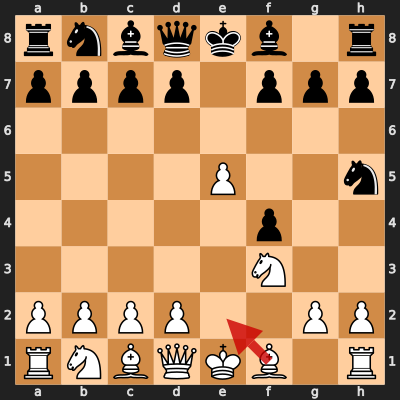
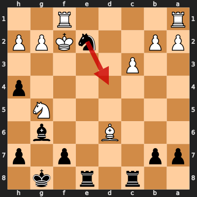
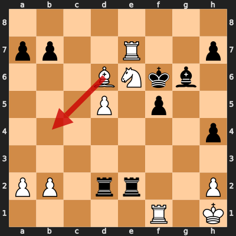

# Game 1: Mikhail Chigorin vs Wilhelm Steinitz

| | |
|---|---|
| Date | 1892.02.28 |
| Result | 0-1 |
| White | Mikhail Chigorin (?) |
| Black | Wilhelm Steinitz (?) |
| Opening | ? |
| Time control | ? |
| Termination | ? |
| Source | ? |

[Download PGN](1/1.pgn)

## Opening theory

**Opening moves**: 1. e4 e5 2. f4 exf4 3. Nf3 Nf6 4. e5 Nh5



Matches a cataloged line (*King's Gambit Accepted: Schallopp Defense*, ECO C34) through 4... Nh5. Mikhail Chigorin played 5. Be2, the first move not found in any named line in this dataset.

**Known continuations from here:**

- 5. g4 (*King's Gambit Accepted: Schallopp Defense, Tashkent Attack*, C34)

## Blunders by both players

### Move 23... Nd4 by Wilhelm Steinitz (Mistake)

**Moves from the start of the game**: 1. e4 e5 2. f4 exf4 3. Nf3 Nf6 4. e5 Nh5 5. Be2 g6 6. d4 Bg7 7. O-O d6 8. Nc3 O-O 9. Ne1 dxe5 10. Bxh5 gxh5 11. dxe5 Qxd1 12. Nxd1 Nc6 13. Bxf4 Bf5 14. Ne3 Be4 15. Nf3 Rfe8 16. Ng5 Bg6 17. Nd5 Bxe5 18. Nxc7 Bxc7 19. Bxc7 Rac8 20. Bg3 Nd4 21. c3 Ne2+ 22. Kf2 h4 23. Bd6

**Better was:** 23... Bh5 24. Nf3 =

**Best continuation:** 24. cxd4 Rc2+ 25. Kg1 Ree2 26. Rae1 Rxg2+ 27. Kh1 Kg7 ±



### Move 32. Bb4 by Mikhail Chigorin (Blunder)

**Moves since the previous diagram**: 23... Nd4 24. cxd4 Rc2+ 25. Kg1 Ree2 26. Rae1 Rxg2+ 27. Kh1 Kg7 28. Re8 f5 29. Ne6+ Kf6 30. Re7 Rge2 31. d5 Rcd2

**Better was:** 32. Rxb7 Bh5 33. Rb3 Rxd5 34. Nf4 Rxd6 35. Nxh5+ Ke7 +-

**Best continuation:** 32... Rxh2+ 33. Kg1 Rdg2# -+



## Full PGN

<details>
<summary>Show movetext</summary>

```pgn
[Event "World Championship"]
[Site "Havana CUB"]
[Date "1892.02.28"]
[Round "23"]
[White "Mikhail Chigorin"]
[Black "Wilhelm Steinitz"]
[Result "0-1"]

1. e4 { +0.36 } 1... e5 { +0.43 } 2. f4 { -0.39 } 2... exf4 { -0.53 } 3. Nf3
{ -0.53 } 3... Nf6 { -0.24 } 4. e5 { -0.26 } 4... Nh5 { -0.58 } 5. Be2
{ -0.50 } 5... g6 { -0.39 } 6. d4 { -0.32 } 6... Bg7 { -0.14 } 7. O-O { +0.00 }
7... d6 { +0.00 } 8. Nc3 { -0.42 } 8... O-O { -0.42 } 9. Ne1 { -0.25 } 9...
dxe5 { -0.42 } 10. Bxh5 { -1.05 } 10... gxh5 { -1.10 } 11. dxe5 { -1.07 } 11...
Qxd1 { -0.97 } 12. Nxd1 { -0.93 } 12... Nc6 { -0.95 } 13. Bxf4 { -1.29 } 13...
Bf5 { -0.30 } 14. Ne3 { -0.33 } 14... Be4 { -0.28 } 15. Nf3 { -0.48 } 15...
Rfe8 { -0.48 } 16. Ng5 { -0.79 } 16... Bg6 { -0.68 } 17. Nd5 { -0.60 } 17...
Bxe5 { -0.69 } 18. Nxc7 { -0.96 } 18... Bxc7 { -0.92 } 19. Bxc7 { -1.00 } 19...
Rac8 { -1.04 } 20. Bg3 { -0.89 } 20... Nd4 { -0.84 } 21. c3 { -1.61 } 21...
Ne2+ { -1.54 } 22. Kf2 { -1.58 } 22... h4 $6 { +0.14 } ( 22... Nxg3 23. hxg3
Re5 24. Nf3 Rb5 25. b3 Rxc3 26. Kg1 $17 ) 23. Bd6 { +0.13 } ( 23. Bd6 Bh5 $10 )
23... Nd4 $2 { +2.66 } ( 23... Bh5 24. Nf3 $10 ) 24. cxd4 { +3.04 } ( 24. cxd4
Rc2+ 25. Kg1 Ree2 26. Rae1 Rxg2+ 27. Kh1 Kg7 $16 ) 24... Rc2+ { +2.97 } 25. Kg1
{ +2.90 } 25... Ree2 { +3.09 } 26. Rae1 { +3.17 } 26... Rxg2+ { +3.18 } 27. Kh1
{ +3.28 } 27... Kg7 { +3.43 } 28. Re8 { +2.80 } 28... f5 { +3.78 } 29. Ne6+ $6
{ +2.19 } ( 29. Re7+ Kg8 30. Rg1 Rge2 31. Rxb7 Rxb2 32. Rxb2 Rxb2 $18 ) 29...
Kf6 { +2.39 } ( 29... Kf6 30. Re7 Rxh2+ 31. Bxh2 Kxe7 32. d5 f4 33. Re1 $16 )
30. Re7 { +2.71 } 30... Rge2 { +2.73 } 31. d5 { +2.77 } 31... Rcd2 { +3.45 }
32. Bb4 $4 { -999.98 } ( 32. Rxb7 Bh5 33. Rb3 Rxd5 34. Nf4 Rxd6 35. Nxh5+ Ke7
$18 ) 32... Rxh2+ { -999.99 } ( 32... Rxh2+ 33. Kg1 Rdg2# $19 ) 0-1
```
</details>
