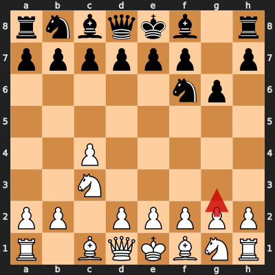
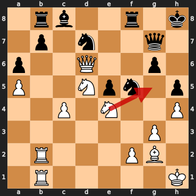

# Game 2: Tigran Petrosian vs David Bronstein

| | |
|---|---|
| Date | 1956.03.28 |
| Result | 0-1 |
| White | Tigran Petrosian (?) |
| Black | David Bronstein (?) |
| Opening | English Opening: Anglo-Indian Defense, Queen's Knight Variation (A16) |
| Time control | ? |
| Termination | ? |
| Source | ? |

[Download PGN](2/2.pgn)

## Opening theory

**Opening moves**: 1. c4 Nf6 2. Nc3 g6



Matches a cataloged line (*English Opening: Anglo-Indian Defense, Queen's Knight Variation*, ECO A16) through 2... g6. Tigran Petrosian played 3. g3, the first move not found in any named line in this dataset.

**Known continuations from here:**

- 3. Nf3 Bg7 4. e4 (*English Opening: Anglo-Indian Defense, Anti-Anti-Grünfeld*, A15)

## Blunders by both players

### Move 36. Ng5 by Tigran Petrosian (Blunder)

**Moves from the start of the game**: 1. c4 Nf6 2. Nc3 g6 3. g3 Bg7 4. Bg2 O-O 5. Nf3 c5 6. O-O Nc6 7. d4 d6 8. dxc5 dxc5 9. Be3 Nd7 10. Qc1 Nd4 11. Rd1 e5 12. Bh6 Qa5 13. Bxg7 Kxg7 14. Kh1 Rb8 15. Nd2 a6 16. e3 Ne6 17. a4 h5 18. h4 f5 19. Nd5 Kh7 20. b3 Rf7 21. Nf3 Qd8 22. Qc3 Qh8 23. e4 fxe4 24. Nd2 Qg7 25. Nxe4 Kh8 26. Rd2 Rf8 27. a5 Nd4 28. b4 cxb4 29. Qxb4 Nf5 30. Rad1 Nd4 31. Re1 Nc6 32. Qa3 Nd4 33. Rb2 Nc6 34. Reb1 Nd4 35. Qd6 Nf5

**Better was:** 36. Qa3 Re8 37. Kg1 Nf8 38. Rb6 Nh7 39. Rxa6 Nd4 +-

**Best continuation:** 36... Nxd6 37. Ne6 Qg8 38. Nxf8 Qxf8 39. Rd1 Nc5 40. Kg1 -+



## Full PGN

<details>
<summary>Show movetext</summary>

```pgn
[Event "Candidates Tournament"]
[Site "Amsterdam NED"]
[Date "1956.03.28"]
[Round "2"]
[White "Tigran Petrosian"]
[Black "David Bronstein"]
[Result "0-1"]
[ECO "E66"]

1. c4 { +0.27 } 1... Nf6 { +0.24 } 2. Nc3 { +0.24 } 2... g6 { +0.57 } 3. g3
{ +0.46 } 3... Bg7 { +0.48 } 4. Bg2 { +0.30 } 4... O-O { +0.42 } 5. Nf3
{ +0.33 } 5... c5 { +0.32 } 6. O-O { +0.35 } 6... Nc6 { +0.42 } 7. d4 { +0.39 }
7... d6 { +0.38 } 8. dxc5 { +0.21 } 8... dxc5 { +0.26 } 9. Be3 { +0.25 } 9...
Nd7 { +0.80 } 10. Qc1 { +0.82 } 10... Nd4 { +1.02 } 11. Rd1 { +1.03 } 11... e5
{ +1.12 } 12. Bh6 { +0.96 } 12... Qa5 { +1.83 } 13. Bxg7 { +1.80 } 13... Kxg7
{ +1.64 } 14. Kh1 { +1.11 } 14... Rb8 { +1.08 } 15. Nd2 { +1.17 } 15... a6
{ +1.29 } 16. e3 { +1.34 } 16... Ne6 { +1.56 } 17. a4 { +1.40 } 17... h5
{ +1.74 } 18. h4 { +1.61 } 18... f5 { +1.77 } 19. Nd5 { +1.77 } 19... Kh7
{ +1.98 } 20. b3 { +1.57 } 20... Rf7 { +2.04 } 21. Nf3 { +1.56 } 21... Qd8
{ +2.20 } 22. Qc3 { +2.10 } 22... Qh8 { +2.22 } 23. e4 { +2.18 } 23... fxe4
{ +2.59 } 24. Nd2 { +2.07 } 24... Qg7 { +1.98 } 25. Nxe4 { +2.18 } 25... Kh8
{ +2.10 } 26. Rd2 { +2.03 } 26... Rf8 { +2.14 } 27. a5 { +2.42 } 27... Nd4
{ +2.79 } 28. b4 { +2.60 } 28... cxb4 { +2.94 } 29. Qxb4 { +3.08 } 29... Nf5
{ +3.74 } 30. Rad1 { +3.75 } 30... Nd4 { +3.84 } 31. Re1 { +2.46 } 31... Nc6
{ +3.70 } 32. Qa3 { +3.94 } 32... Nd4 { +5.28 } 33. Rb2 { +3.62 } 33... Nc6
{ +3.84 } 34. Reb1 { +3.45 } 34... Nd4 { +4.26 } 35. Qd6 { +3.77 } 35... Nf5
{ +3.77 } 36. Ng5 $4 { -5.91 } ( 36. Qa3 Re8 37. Kg1 Nf8 38. Rb6 Nh7 39. Rxa6
Nd4 $18 ) 36... Nxd6 { -5.89 } ( 36... Nxd6 37. Ne6 Qg8 38. Nxf8 Qxf8 39. Rd1
Nc5 40. Kg1 $19 ) 0-1
```
</details>
