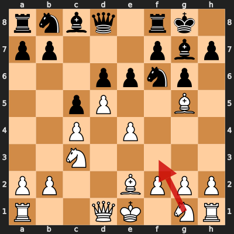

# Game 3: Miguel Najdorf vs Robert James Fischer

| | |
|---|---|
| Date | 1966.07.27 |
| Result | 1-0 |
| White | Miguel Najdorf (?) |
| Black | Robert James Fischer (?) |
| Opening | E75 |
| Time control | ? |
| Termination | ? |
| Source | ? |

[Download PGN](3/3.pgn)

## Opening theory

**Opening moves**: 1. d4 Nf6 2. c4 g6 3. Nc3 Bg7 4. e4 d6 5. Be2 O-O 6. Bg5 c5 7. d5 e6



Matches a cataloged line (*King's Indian Defense: Averbakh Variation, Main Line*, ECO E75) through 7... e6. Miguel Najdorf played 8. Nf3, the first move not found in any named line in this dataset.

## Blunders by both players

No blunders (Mistake or worse) by both players found in this game.

## Full PGN

<details>
<summary>Show movetext</summary>

```pgn
[Event "Piatigorsky Cup"]
[Site "Santa Monica USA"]
[Date "1966.07.27"]
[Round "7"]
[White "Miguel Najdorf"]
[Black "Robert James Fischer"]
[Result "1-0"]
[ECO "E75"]

1. d4 { +0.35 } 1... Nf6 { +0.35 } 2. c4 { +0.25 } 2... g6 { +0.37 } 3. Nc3
{ +0.39 } 3... Bg7 { +0.58 } 4. e4 { +0.64 } 4... d6 { +0.59 } 5. Be2 { +0.48 }
5... O-O { +0.54 } 6. Bg5 { +0.36 } 6... c5 { +0.38 } 7. d5 { +0.28 } 7... e6
{ +0.21 } 8. Nf3 { +0.31 } 8... h6 { +0.18 } 9. Bh4 { +0.12 } 9... exd5
{ -0.02 } 10. cxd5 { -0.04 } 10... g5 { -0.12 } 11. Bg3 { -0.05 } 11... b5
{ +0.51 } 12. Nd2 { +0.50 } 12... a6 { +0.55 } 13. O-O { +0.42 } 13... Re8
{ +0.44 } 14. Qc2 { +0.24 } 14... Qe7 { +1.29 } 15. Rae1 { +1.26 } 15... Nbd7
{ +1.31 } 16. a4 { +1.30 } 16... b4 { +1.26 } 17. Nd1 { +1.42 } 17... Ne5
{ +1.34 } 18. Ne3 { +1.30 } 18... Ng6 { +1.61 } 19. Nec4 { +1.64 } 19... Nf4
{ +1.69 } 20. Bxf4 { +1.72 } 20... gxf4 { +1.75 } 21. e5 { +1.77 } 21... dxe5
{ +1.81 } 22. Bf3 { +1.82 } 22... Qf8 { +2.14 } 23. Nxe5 { +2.19 } 23... Bb7
{ +2.49 } 24. Ndc4 { +2.75 } 24... Rad8 { +2.77 } 25. Nc6 { +2.90 } 25... Rxe1
{ +3.12 } 26. Rxe1 { +3.10 } 26... Re8 { +3.23 } 27. Rd1 { +3.33 } 27... Rc8
{ +3.25 } 28. h3 { +2.78 } 28... Ne8 { +4.18 } 29. N6a5 { +4.40 } 29... Rb8
{ +4.48 } 30. Qf5 { +4.65 } 30... Nd6 { +5.73 } 31. Nxd6 { +5.91 } 1-0
```
</details>
