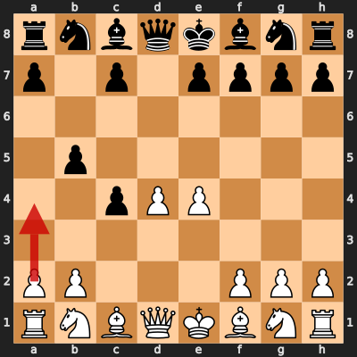
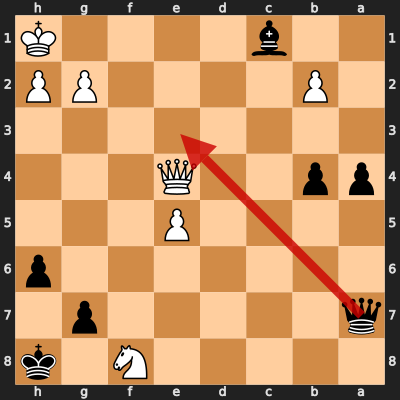

# Game 4: Deep Fritz 10 vs Vladimir Kramnik

| | |
|---|---|
| Date | 2006.11.27 |
| Result | 1-0 |
| White | Deep Fritz 10 (?) |
| Black | Vladimir Kramnik (?) |
| Opening | Queen's Gambit Accepted: Central Variation, Greco Variation (D20) |
| Time control | ? |
| Termination | ? |
| Source | ? |

[Download PGN](4/4.pgn)

## Opening theory

**Opening moves**: 1. d4 d5 2. c4 dxc4 3. e4 b5



Matches a cataloged line (*Queen's Gambit Accepted: Central Variation, Greco Variation*, ECO D20) through 3... b5. Deep Fritz 10 played 4. a4, the first move not found in any named line in this dataset.

## Blunders by both players

### Move 34... Qe3 by Vladimir Kramnik (Blunder)

**Moves from the start of the game**: 1. d4 d5 2. c4 dxc4 3. e4 b5 4. a4 c6 5. Nc3 b4 6. Na2 Nf6 7. e5 Nd5 8. Bxc4 e6 9. Nf3 a5 10. Bg5 Qb6 11. Nc1 Ba6 12. Qe2 h6 13. Be3 Bxc4 14. Qxc4 Nd7 15. Nb3 Be7 16. Rc1 O-O 17. O-O Rfc8 18. Qe2 c5 19. Nfd2 Qc6 20. Qh5 Qxa4 21. Nxc5 Nxc5 22. dxc5 Nxe3 23. fxe3 Bxc5 24. Qxf7+ Kh8 25. Qf3 Rf8 26. Qe4 Qd7 27. Nb3 Bb6 28. Rfd1 Qf7 29. Rf1 Qa7 30. Rxf8+ Rxf8 31. Nd4 a4 32. Nxe6 Bxe3+ 33. Kh1 Bxc1 34. Nxf8

**Better was:** 34... Kg8 35. Ng6 Qe3 36. Qc4+ Kh7 37. Nf8+ Kh8 38. Ng6+ =

**Best continuation:** 35. Qh7# +-



## Full PGN

<details>
<summary markdown="span">Show movetext</summary>

```pgn
[Event "Man vs Machine"]
[Site "Bonn GER"]
[Date "2006.11.27"]
[Round "2"]
[White "Deep Fritz 10"]
[Black "Vladimir Kramnik"]
[Result "1-0"]
[ECO "D10"]

1. d4 { +0.26 } 1... d5 { +0.33 } 2. c4 { +0.29 } 2... dxc4 { +0.29 } 3. e4
{ +0.41 } 3... b5 { +0.69 } 4. a4 { +0.71 } 4... c6 { +0.66 } 5. Nc3 { +0.30 }
5... b4 { +0.29 } 6. Na2 { +0.11 } 6... Nf6 { +0.07 } 7. e5 { +0.10 } 7... Nd5
{ +0.08 } 8. Bxc4 { +0.09 } 8... e6 { +0.20 } 9. Nf3 { +0.23 } 9... a5
{ +0.22 } 10. Bg5 { +0.24 } 10... Qb6 { +0.23 } 11. Nc1 { +0.33 } 11... Ba6
{ +0.30 } 12. Qe2 { -0.09 } 12... h6 { +0.00 } 13. Be3 { -0.02 } 13... Bxc4
{ -0.17 } 14. Qxc4 { -0.20 } 14... Nd7 { -0.23 } 15. Nb3 { -0.05 } 15... Be7
{ -0.03 } 16. Rc1 { +0.00 } 16... O-O { -0.03 } 17. O-O { +0.00 } 17... Rfc8
{ +0.00 } 18. Qe2 { -0.18 } 18... c5 { -0.31 } 19. Nfd2 { -0.39 } 19... Qc6
{ -0.32 } 20. Qh5 { -0.88 } 20... Qxa4 { -0.72 } 21. Nxc5 { -0.97 } 21... Nxc5
{ -1.02 } 22. dxc5 { -1.13 } 22... Nxe3 { -1.13 } 23. fxe3 { -1.11 } 23... Bxc5
{ -1.14 } 24. Qxf7+ { -1.17 } 24... Kh8 { -1.20 } 25. Qf3 { -1.18 } 25... Rf8
{ -1.24 } 26. Qe4 { -1.17 } 26... Qd7 { -0.90 } 27. Nb3 { -1.01 } 27... Bb6
{ -1.34 } 28. Rfd1 { -1.09 } 28... Qf7 { -1.10 } 29. Rf1 { -0.96 } 29... Qa7
{ -1.03 } 30. Rxf8+ { -1.40 } 30... Rxf8 { -1.34 } 31. Nd4 { -1.34 } 31... a4
{ -0.50 } 32. Nxe6 { -0.40 } 32... Bxe3+ { -0.45 } 33. Kh1 { -0.64 } 33... Bxc1
{ +0.00 } 34. Nxf8 { +0.00 } 34... Qe3 $4 { +999.99 } ( 34... Kg8 35. Ng6 Qe3
36. Qc4+ Kh7 37. Nf8+ Kh8 38. Ng6+ $10 ) 35. Qh7# { +1000.00 } ( 35. Qh7# $18 )
1-0
```
</details>
