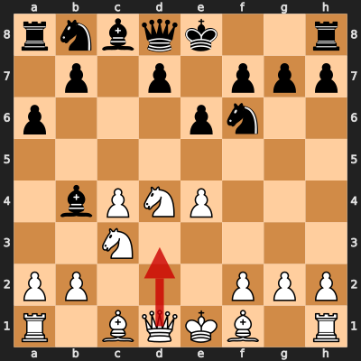
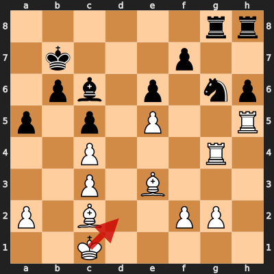
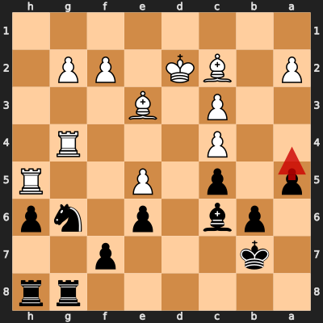
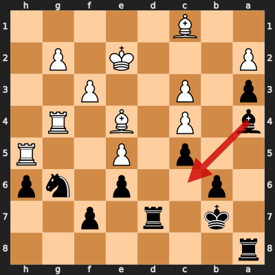

# Game 5: Magnus Carlsen vs Viswanathan Anand

| | |
|---|---|
| Date | 2014.11.15 |
| Result | 1-0 |
| White | Magnus Carlsen (?) |
| Black | Viswanathan Anand (?) |
| Opening | Sicilian Defense: Kan Variation, Maróczy Bind, Réti Variation (B41) |
| Time control | ? |
| Termination | ? |
| Source | ? |

[Download PGN](5/5.pgn)

## Opening theory

**Opening moves**: 1. e4 c5 2. Nf3 e6 3. d4 cxd4 4. Nxd4 a6 5. c4 Nf6 6. Nc3 Bb4



Matches a cataloged line (*Sicilian Defense: Kan Variation, Maróczy Bind, Réti Variation*, ECO B41) through 6... Bb4. Magnus Carlsen played 7. Qd3, the first move not found in any named line in this dataset.

**Known continuations from here:**

- 7. Bd3 Nc6 (*Sicilian Defense: Kan Variation, Maróczy Bind, Bronstein Variation*, B41)

## Blunders by both players

### Move 26. Kd2 by Magnus Carlsen (Mistake)

**Moves from the start of the game**: 1. e4 c5 2. Nf3 e6 3. d4 cxd4 4. Nxd4 a6 5. c4 Nf6 6. Nc3 Bb4 7. Qd3 Nc6 8. Nxc6 dxc6 9. Qxd8+ Kxd8 10. e5 Nd7 11. Bf4 Bxc3+ 12. bxc3 Kc7 13. h4 b6 14. h5 h6 15. O-O-O Bb7 16. Rd3 c5 17. Rg3 Rag8 18. Bd3 Nf8 19. Be3 g6 20. hxg6 Nxg6 21. Rh5 Bc6 22. Bc2 Kb7 23. Rg4 a5 24. Bd1 Rd8 25. Bc2 Rdg8

**Better was:** 26. Rg3 a4 +=

**Best continuation:** 26... Nxe5 27. Rxg8 Nxc4+ 28. Ke2 Rxg8 29. g3 Na3 30. Kd2 ∓



### Move 26... a4 by Viswanathan Anand (Mistake)

**Moves since the previous diagram**: 26. Kd2

**Better was:** 26... Nxe5 27. Rxg8 Nxc4+ 28. Ke2 Rxg8 29. g3 Na3 30. Kd2 ∓

**Best continuation:** 27. Ke2 Ne7 +=



<details>
<summary>Move 32... Bc6 by Viswanathan Anand (Inaccuracy)</summary>

**Moves since the previous diagram**: 26... a4 27. Ke2 a3 28. f3 Rd8 29. Ke1 Rd7 30. Bc1 Ra8 31. Ke2 Ba4 32. Be4+

**Better was:** 32... Ka7 +=

**Best continuation:** 33. Bxg6 ±



</details>

## Full PGN

<details>
<summary>Show movetext</summary>

```pgn
[Event "World Championship"]
[Site "Sochi RUS"]
[Date "2014.11.15"]
[Round "6"]
[White "Magnus Carlsen"]
[Black "Viswanathan Anand"]
[Result "1-0"]
[ECO "B41"]

1. e4 { +0.32 } 1... c5 { +0.41 } 2. Nf3 { +0.36 } 2... e6 { +0.44 } 3. d4
{ +0.51 } 3... cxd4 { +0.40 } 4. Nxd4 { +0.48 } 4... a6 { +0.57 } 5. c4
{ +0.43 } 5... Nf6 { +0.41 } 6. Nc3 { +0.40 } 6... Bb4 { +0.35 } 7. Qd3
{ +0.28 } 7... Nc6 { +0.63 } 8. Nxc6 { +0.62 } 8... dxc6 { +0.65 } 9. Qxd8+
{ +0.69 } 9... Kxd8 { +0.68 } 10. e5 { +0.64 } 10... Nd7 { +0.67 } 11. Bf4
{ +0.71 } 11... Bxc3+ { +0.60 } 12. bxc3 { +0.53 } 12... Kc7 { +0.71 } 13. h4
{ +0.71 } 13... b6 { +0.73 } 14. h5 { +0.70 } 14... h6 { +0.54 } 15. O-O-O
{ +0.65 } 15... Bb7 { +0.63 } 16. Rd3 { +0.47 } 16... c5 { +0.44 } 17. Rg3
{ +0.40 } 17... Rag8 { +0.37 } 18. Bd3 { +0.31 } 18... Nf8 { +0.33 } 19. Be3
{ +0.52 } 19... g6 { +0.53 } 20. hxg6 { +0.41 } 20... Nxg6 { +0.46 } 21. Rh5
{ +0.40 } 21... Bc6 { +0.40 } 22. Bc2 { +0.21 } 22... Kb7 { +0.67 } 23. Rg4
{ +0.29 } 23... a5 { +0.43 } 24. Bd1 { +0.29 } 24... Rd8 { +0.43 } 25. Bc2
{ +0.32 } 25... Rdg8 { +0.47 } 26. Kd2 $2 { -2.32 } ( 26. Rg3 a4 $14 ) 26... a4
$2 { +0.52 } ( 26... Nxe5 27. Rxg8 Nxc4+ 28. Ke2 Rxg8 29. g3 Na3 30. Kd2 $17 )
( 26... Nxe5 27. Rxg8 Nxc4+ 28. Ke2 Rxg8 29. g3 Na3 30. Kd2 $17 ) 27. Ke2
{ +0.47 } ( 27. Ke2 Ne7 $14 ) 27... a3 { +0.50 } 28. f3 { +0.63 } 28... Rd8
{ +0.57 } 29. Ke1 { +0.44 } 29... Rd7 { +0.66 } 30. Bc1 { +0.46 } 30... Ra8
{ +0.85 } 31. Ke2 { +0.62 } 31... Ba4 { +0.93 } 32. Be4+ { +0.77 } 32... Bc6 $6
{ +1.96 } ( 32... Ka7 $14 ) 33. Bxg6 { +2.21 } ( 33. Bxg6 $16 ) 33... fxg6
{ +2.28 } 34. Rxg6 { +2.21 } 34... Ba4 { +2.59 } 35. Rxe6 { +2.83 } 35... Rd1
{ +2.54 } 36. Bxa3 { +2.68 } 36... Ra1 { +2.73 } 37. Ke3 { +2.80 } 37... Bc2
{ +4.42 } 38. Re7+ { +4.68 } 1-0
```
</details>
